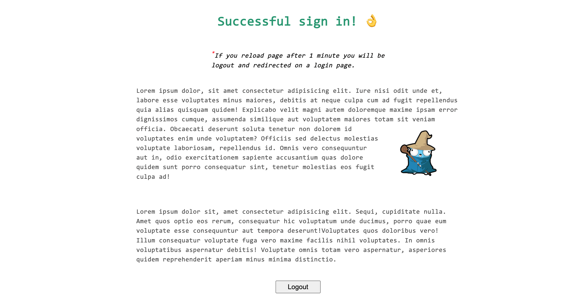

## Simple auth app example with cookie sessions.

# Description
App has a one user. See example.env file, where user credentials is located.

### Screenshot



## Prepare project data:

- Create .env file in the root of project and paste inside your user credentials, ports and certificates path. (See example.env file)

- Generate TLS certificates for local usage.

### Generate tls certificates
Convenient way to do that with a great [mkcert](https://github.com/FiloSottile/mkcert) tool.

```
$ mkcert auth.signin.dev localhost
```

### Project URL:
[http://localhost:8080](https://localhost:8080) (auto redirect to https)
 - port specify in .env file

# Useful commands
Build binary with maximum reduced build size.

### Reduce build size

```
$ go build -ldflags "-s -w"
$ upx -f --brute -o build_name.upx build_name
```